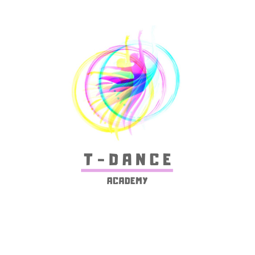

# PROYECTO 1: Landing de Negocio

## **ÍNDICE**

* [1. Intro](#1-intro)
* [2. Objetivos de Aprendizaje](#2-objetivos-de-aprendizaje)
* [3. Prototipado](#3-prototipado)
* [4. Conclusión](#4-conclusión)

****

## 1. Intro

Este proyecto tiene como objetivo generar una página de negocios.

Esta landing page esta dirigida a cualquier persona que desee aprender algún estilo de baile
ya sea de tipo clásico com Ballet o Ballet Contemporáneo, culturales como las danzas Polinesias
hasta los de tipo urbano como el HipHop, Break Dance.

Uno de los objetivos es poder ayudar a las personas a encontrar el estilo de baile adecuado según
sus aptitudes y habilidades.

****

## 2. Objetivos de aprendizaje

Utilizar única y exclusivamente HTML y CSS para desarrollar la interfaz de la página.
Utilizar la herrarmienta [Drawio](https://app.diagrams.net/) para realizar el prototipado de la página.

****

## 3. Prototipado   

Utilizando la herrarmienta [Drawio](https://app.diagrams.net/) se realizó el prototipado de la página, en este caso solo se prototipo para Estaciones de escritorio, Mobil ( Iphone 6/7/8 y X) y Ipad.
El archivo lo puedes localizar en (./prototipado/t-dance_prototype.drawio)

****

## 4. Conclusión

1. Poner en práctica ya en conjunto los conocimientos aprendidos para HTML, CSS, y Prototipado, así como la utilización del mayor número de etiquetas aprendidas teniendo como finalidad ver la funcionalidad que aportan.
2. Diseñar la interfaz y buscar la forma de ser lo más amigable posible con los usuarios.
3. Generar el proyecto de forma estructurada para aplicar las mejores prácticas de desarrollo.

